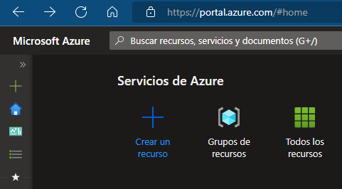
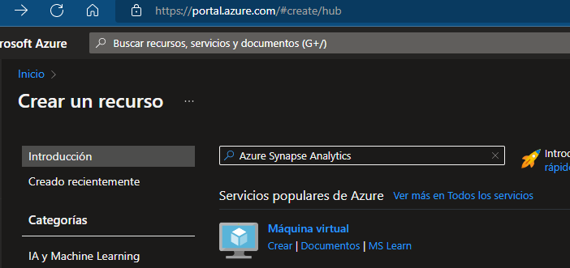
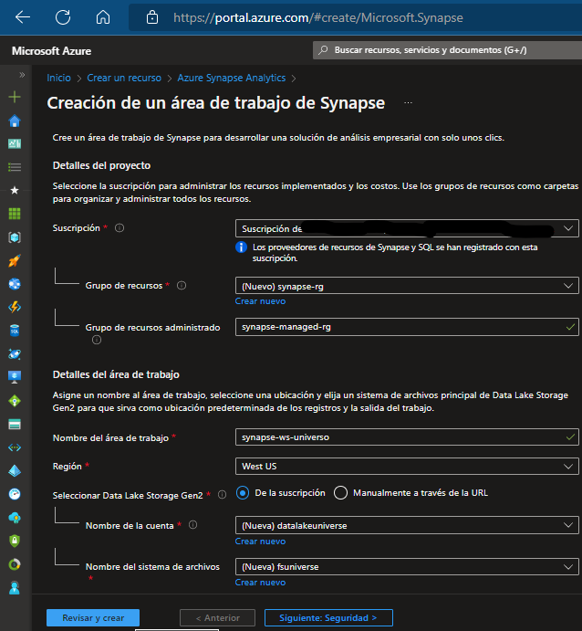
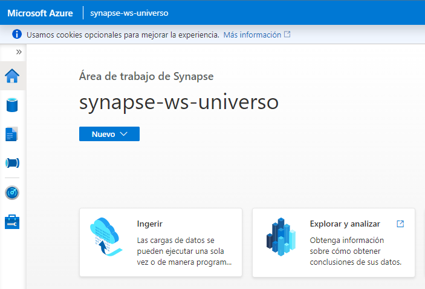

# Análisis de datos en tiempo real usando la versión preliminar de _Azure Synapse Data Explorer_

## Welcome aboard! :octocat:

💥En este repo encontrarán recursos y la guía para el taller técnico "El mundo de Synapse dentro del universo de Azure" impartido para la comunidad de Colombia . Aquí podrán encontrar los elementos necesarios para poder trabajar con esta herramientos. Además, más abajo podrán encontrar recursos extras si están interesados en el mundo de la data.💥 

💡 _En este link pueden consultar la  [presentación online](https://www.canva.com/design/DAFTqOkijyE/HT6Mj7NaAov4jhz59hSCCg/view?utm_content=DAFTqOkijyE&utm_campaign=designshare&utm_medium=link&utm_source=publishpresent )._

<h2> Creación de recursos. 👾 <h/2>

**Pasos a seguir:**

📌 Contar con una cuenta en [Azure Portal](https://portal.azure.com/).
  
📌 En la página de inicio de hacemos clic en el botón de _Crear_.
  
  
  
📌 En el buscador colocamos _Azure Synapse Analytics_.
  
    
  
📌 Le asignamos una configuración de la siguiente manera.
  
**Suscripción:**
  
      suscripción de Azure 
  
**Grupo de recursos:**
  
      synapse-rg
      
Grupo de recursos administrado: 
  
      synapse-managed-rg 
      
Nombre del área de trabajo:
  
      synapse-ws-universo
      
**Región:** Seleccionamos la región donde será consumido por el cliente final.    
      
**Seleccionar Data Lake Storage Gen 2:** en la suscripción.
  
**Nombre de cuenta:**
  
      datalakeuniverse
  
**Nombre del sistema de archivos:** 
  
      fsuniverse
  
        
   
📌 Una vez configurado hacemos clic en el botón de _Revisar y Crear_ y si todo sale bien hacemos clic en el botón de _Crear_ para poder obtener los recursos que usaremos, esto puede demorar un tiempo aproximado de 5 minutos. 

📌 Una vez que se haya completado la implementación se podrán observar 2 recursos, hacemos clic en el recurso de Synapse que nos redirigirá hacia _Synapse Studio_ mostrandonos una interfaz como la siguiete.
  
   
   

 <h2>  Creación de un grupo de Data Explorer :octocat: <h/2>

   
📌 Dentro de _Synapse Studio_ nos dirigiremos a la siguiente ruta.
      
      Administrar > Grupos de Data Explorer > Nuevo

📌 Asignaremos la siguiente configuración.

**Nombre del grupo de Data Explorer:**
  
      dxpool
      
**Carga de trabajo:**
  
      optimizado para proceso

**Tamaño:**
  
      extra pequeño (2 núcleos)

📌 En la pestaña de _configuración adicional_ habilitaremos la opción de _ingesta de streaming_.

📌 Finalmente, seleccionamos el botón de _Revisar y crear_ para crear el grupo, esto puede demorar hasta 15 minutos.

 <h2> Creación de BD y consumo de datos. 👾 <h/2>

📌 Dentro de _Synapse Studio_ seleccionaremos la etiqueta de _Datos_ en la opción de _Base de Datos de Data Explorer_ donde debería aparecer _dxpool_

📌 En el panel Datos, hacemos clic en el símbolo ＋ para crear una base de datos de Data Explorer nueva en el grupo dxpool con el nombre.

     iot-data

📌 Dentro de _Synapse Studio_ nos dirigimos al _menú_, a la nuesv BD que nombramos  iot-data, abrimos  _Azure Data Explorer y seleccionamos _Ingerir datos nuevos_ donde insertaremos los datos que simulan un servicio de IoT.

  * El descargable se encuentra [aquí en .csv](https://github.com/LizzyLucas/AzureSynapseDataExplorer-workshop/blob/main/Resources/devices.csv).

Nota: _Al finalizar no olviden eliminar todos los recursos creados y el grupo de recursos también._

<h2> Recomendaciones extra. 💡 <h/2>

  ☁️  [Lección guía para esta taller](https://learn.microsoft.com/es-es/training/modules/explore-fundamentals-stream-processing/9-exercise-data-explorer).
  ☁️  [Microsoft Learn](https://learn.microsoft.com/es-es/).
  ☁️  [Azure Days](https://mvtd.events.microsoft.com/?language=Espa%C3%B1ol).
  ☁️  [Ruta de aprendizaje para el DP-900](https://learn.microsoft.com/es-es/certifications/azure-data-fundamentals/).

##

**¡Bievenidas contribuciones!** :octocat: Built by _Lizzie Lucas_ 🛠️

